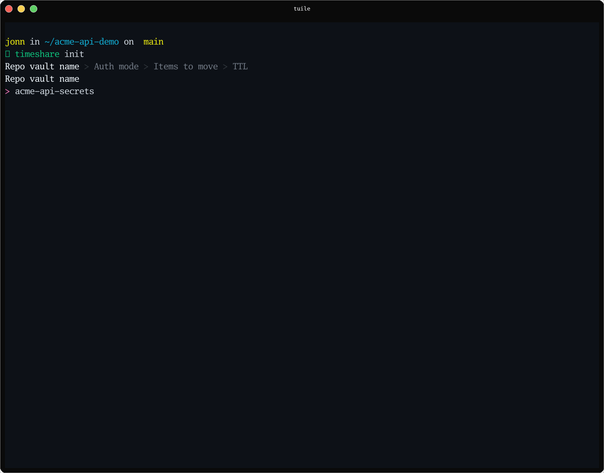
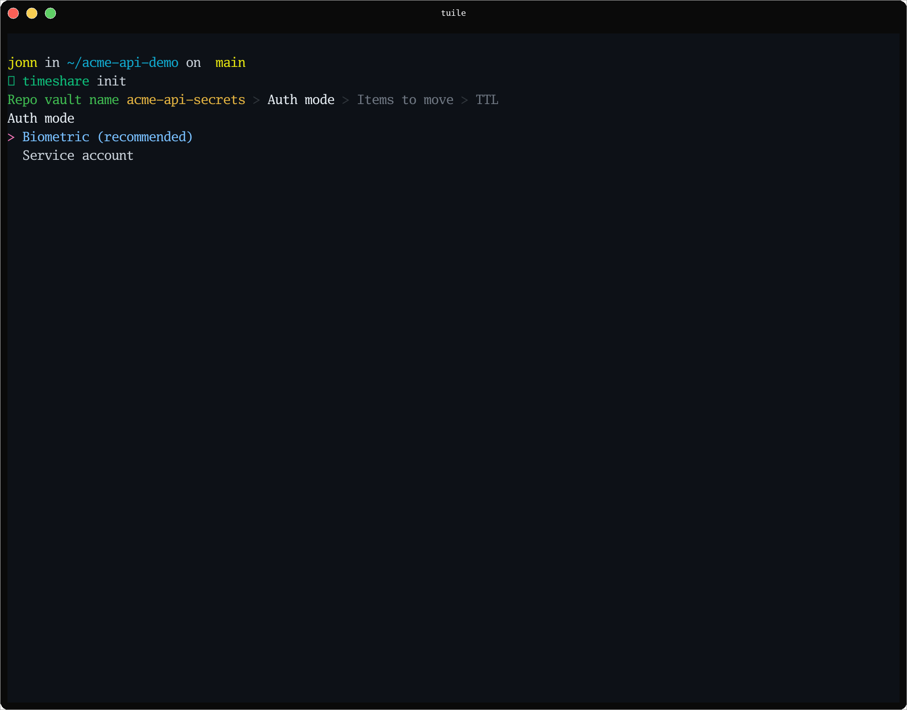
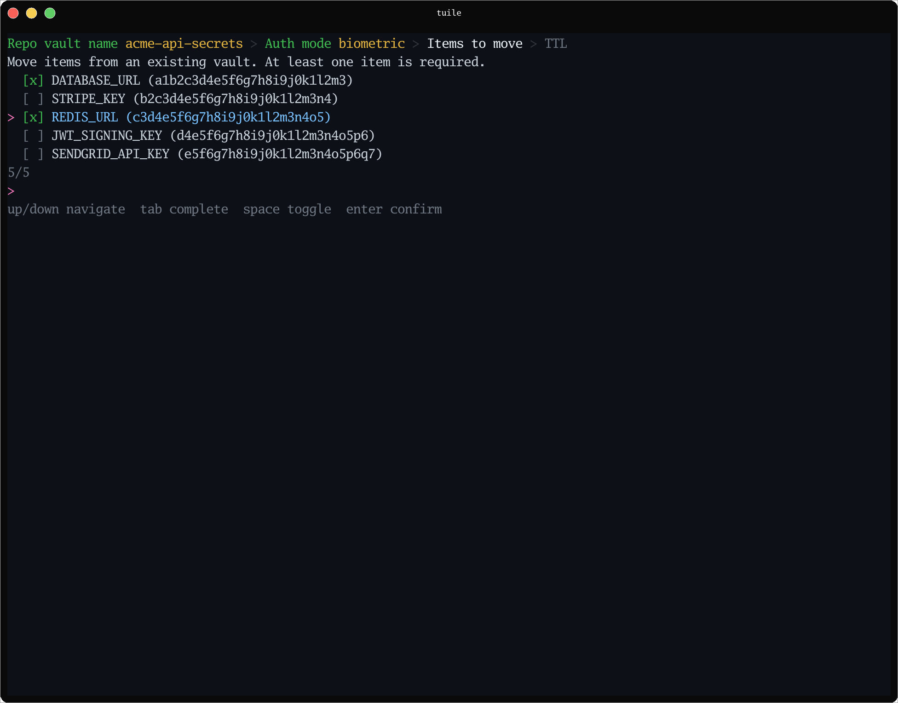

# timeshare

A local, repo-scoped, TTL-caching secret bridge for 1Password.

If a script or AI agent reads secrets from 1Password in a loop (`op read` N
times), 1Password's biometric approval prompt fires N times. `timeshare`
runs a small per-user background daemon that caches a resolved secret for a
configurable TTL, so a repo's first read in that window prompts once and
every read after that — until the TTL expires — doesn't touch 1Password
again.

## Status

Early. Two of the two auth modes are implemented at the protocol level, but
only one is fully usable end to end right now:

- **Biometric mode** (shells out to `op read`, same prompt you already get):
  works today.
- **Service-account mode** (headless, token-based, no prompts): the daemon
  side is implemented, but nothing in `timeshare` provisions the token for
  you automatically — see [Service-account mode](#service-account-mode)
  below.
- **Platforms:** Linux is the primary target and has run for real. macOS:
  daemon auto-spawn, Unix socket permissions, and peer verification
  (Xucred/LOCAL_PEERCRED) have been confirmed working against a real Mac —
  but item resolution currently only works for Login-category items (see
  [Known gaps](#known-gaps)), so a full read/run cycle isn't yet verified
  end to end on macOS. Windows is explicitly out of scope for now (Unix
  socket IPC).

## Install

**Script** (installs both binaries, fixes `PATH` if needed, checks for the
1Password CLI):

```sh
curl -fsSL https://raw.githubusercontent.com/newtosh/timeshare/main/install.sh | sh
```

This pipes a script straight into `sh` — for a tool that touches your
secrets, read it first rather than trusting blindly:
[install.sh](https://github.com/newtosh/timeshare/blob/main/install.sh).

**Manual**, if you'd rather run the commands yourself:

```sh
go install github.com/newtosh/timeshare/cmd/timeshare@latest github.com/newtosh/timeshare/cmd/timesharedd@latest
```

Both land in `$(go env GOPATH)/bin` — make sure that's on your `PATH`.
`timesharedd` never needs to be started by hand — `timeshare` auto-spawns
it on first use, the way `ssh-agent` works.

Tagged releases (`vMAJOR.MINOR.PATCH`) publish linux/darwin amd64+arm64
binaries on the [GitHub Releases](https://github.com/newtosh/timeshare/releases)
page. `go install …@latest` resolves to the newest tag; pin a version with
`@v0.1.0` (or whatever the current release is). Check what you have with
`timeshare --version`.

You'll also need the [1Password CLI](https://developer.1password.com/docs/cli/)
(`op`) installed and signed in.

Building from a local clone instead (e.g. to test an unmerged change) is a
contributor workflow — see [CONTRIBUTING.md](CONTRIBUTING.md).

## Quickstart

From inside a git repo, bare `timeshare init` drops you into a guided
wizard — no flags to look up first:



Pick an auth mode:



Then pick which items to copy into the new vault from an existing one — a
live, fuzzy-filtering, fzf-style picker, not a flag you have to get exactly
right on the first try:



The wizard creates a dedicated 1Password vault, writes `.timeshare.yml` at
the repo root, and copies the items you picked from the existing vault into
the new one (via `op item get | op item create`) — the originals stay put.

**Scripts and CI** should use the flag-driven form instead — it never
prompts:

```sh
timeshare init --vault=my-project-secrets --mode=biometric --item=DATABASE_URL --item=STRIPE_KEY --non-interactive
```

`--from=<existing-vault>` (instead of or alongside `--item`) copies every
matching item out of an existing vault the same way the wizard does. Add
`--move` to move items out of the source vault instead of copying them.
Run `timeshare init --help` for the full flag list — short forms exist for
the common ones (`-v`, `-m`, `-t`, `-i`, `-f`, `-n`).

Then, either way:

```sh
timeshare read DATABASE_URL
# prompts for biometric approval the first time, prints the value

timeshare read DATABASE_URL
# same call again within the TTL window: no prompt, served from cache

timeshare run -- npm start
# resolves every item in .timeshare.yml, injects as env vars, execs npm start
```

## `.timeshare.yml`

Written by `init`, safe to commit — it never contains a credential, only
policy:

```yaml
vault: my-project-secrets
mode: biometric   # or: service-account
ttl: 4h
items:
  - DATABASE_URL
  - STRIPE_KEY
ssh_keys:
  - Private/deploy-key-prod
```

`items` is an allow-list enforced by the daemon itself, independent of
whatever the underlying 1Password vault grant would otherwise permit — see
[SECURITY.md](SECURITY.md).

`ssh_keys` is optional and works differently: each entry is a
`<vault>/<item>` reference to an SSH Key item that already exists in
1Password — `init` never moves or copies it anywhere, only records where
it lives. See [SSH key access](#ssh-key-access), below.

## SSH key access

`timeshare run` can also grant a repo time-boxed access to SSH keys
already stored in 1Password, without exposing every key loaded in your
account (1Password's own SSH agent, unfiltered, does exactly that to
anything that connects to its socket).

```sh
timeshare init --ssh-key=Private/deploy-key-prod --vault=my-project-secrets --mode=biometric --item=DATABASE_URL --non-interactive
# or pick interactively: bare `timeshare init` has a skippable "SSH keys" wizard step

timeshare run -- git push
# SSH_AUTH_SOCK points at a proxy, filtered to just the ssh_keys this
# repo's .timeshare.yml lists, torn down when the command exits
```

The proxy never holds private key material — it forwards signing
requests to your real 1Password SSH agent only for allow-listed keys,
only within the repo's TTL window (same TTL as secrets). Past that
window, or for any key not listed, the proxy refuses the request; your
real 1Password agent and every other tool using it are unaffected.

**A config gotcha to know about:** if your `~/.ssh/config` sets
`IdentityAgent` for a host (rather than relying on the `SSH_AUTH_SOCK`
env var), OpenSSH's own precedence rules mean that setting wins over
`run`'s override — `ssh`/`git` will silently keep using your real,
unfiltered 1Password agent for that host instead of the proxy. Fix it
per-command with:

```sh
GIT_SSH_COMMAND='ssh -o IdentityAgent="$SSH_AUTH_SOCK"' timeshare run -- git push
```

or scope the `IdentityAgent` line in `~/.ssh/config` to a `Host` pattern
that excludes repos you run through timeshare.

## Commands

| Command | What it does |
|---|---|
| `timeshare --version` | Print embedded semver / commit / build date |
| `timeshare init` | Scaffold a dedicated vault + `.timeshare.yml` for the current repo |
| `timeshare read <name>` | Resolve one secret, print to stdout (drop-in for `op read`) |
| `timeshare run -- <cmd>` | Resolve every item in `.timeshare.yml`, inject as env vars, exec `<cmd>` |
| `timeshare status` | Confirm the daemon is reachable for the current project (non-zero exit if not) |
| `timeshare lock` | Evict this project's cached secrets immediately |
| `timeshare doctor` | Check: `op` on PATH, daemon socket reachable, `.timeshare.yml` present, and (if `ssh_keys` is set) the upstream SSH agent reachable — non-zero exit if any check fails |
| `timeshare token store <vault>` / `token delete <vault>` | Manage a service-account token in the OS keychain (see below) |

Run `timeshare <command> --help` for flags.

## Service-account mode

Service-account mode is headless — no biometric prompt at all — but it
needs a token, and `timeshare` deliberately doesn't create or hold that
token on your behalf during `init` (an earlier version did, and it was a
bug: it created a real 1Password service account and threw the only
credential away). Current flow:

```sh
timeshare init --vault=my-project-secrets --mode=service-account --item=DATABASE_URL --non-interactive
# prints the exact `op service-account create ...` command to run

op service-account create my-project-secrets-timeshare --vault=<vault-id>:read_items
# 1Password prints a token — copy it

echo 'paste-the-token-here' | timeshare token store my-project-secrets
# stores it in your OS keychain (macOS Keychain / Linux Secret Service via
# gnome-keyring or kwallet)
```

The daemon resolves a service-account token at request time by checking,
in order:

1. `TIMESHARE_SA_TOKEN_<SANITIZED_VAULT>` env var (vault name uppercased,
   non-alphanumeric runs collapsed to `_` — e.g. `my-project-secrets` →
   `TIMESHARE_SA_TOKEN_MY_PROJECT_SECRETS`). Useful for CI/headless boxes
   with no Secret Service provider running.
2. The OS keychain, via `timeshare token store`.

The env var always wins if set — the daemon logs when that happens, so a
stale exported token silently shadowing a rotated keychain one is at least
visible in the daemon's own log output.

## Security model

See [SECURITY.md](SECURITY.md) — peer verification, the allow-list's
actual (blast-radius, not adversarial) threat model, no-secrets-on-disk,
and wall-clock TTL.

## Contributing

See [CONTRIBUTING.md](CONTRIBUTING.md) — local dev setup, `make check`,
pre-commit/pre-push hooks, and workflow conventions.

## Known gaps

- `timeshare status` doesn't yet show per-secret TTLs (spec goal, not yet
  implemented — the cache has no enumeration method).
- `timeshare doctor` checks `op` on PATH, daemon reachable, config
  present, and (if `ssh_keys` is set) the upstream SSH agent; it doesn't
  yet check `op` version, token validity, or socket permission bits.
- No disk-persisted cache — a daemon restart mid-TTL-window means the next
  read re-prompts. Planned as a follow-up once the in-memory version has
  seen real use (see the design spec in `docs/superpowers/specs/`).
- Windows isn't supported (Unix socket IPC).
- `read`/`run` only resolve Login-category items — the field is hardcoded
  to `password` when building the `op://` reference, so Secure Notes and
  items with custom fields aren't usable yet. Item titles containing `/`
  or other characters `op` treats specially in a secret reference can also
  fail to resolve; referencing by item ID works around it in the meantime.
- `timeshare doctor`'s SSH check confirms the upstream agent socket is
  reachable; it doesn't detect an `~/.ssh/config` `IdentityAgent`
  override that would silently bypass the proxy (see [SSH key
  access](#ssh-key-access)) — documented, not auto-detected.
